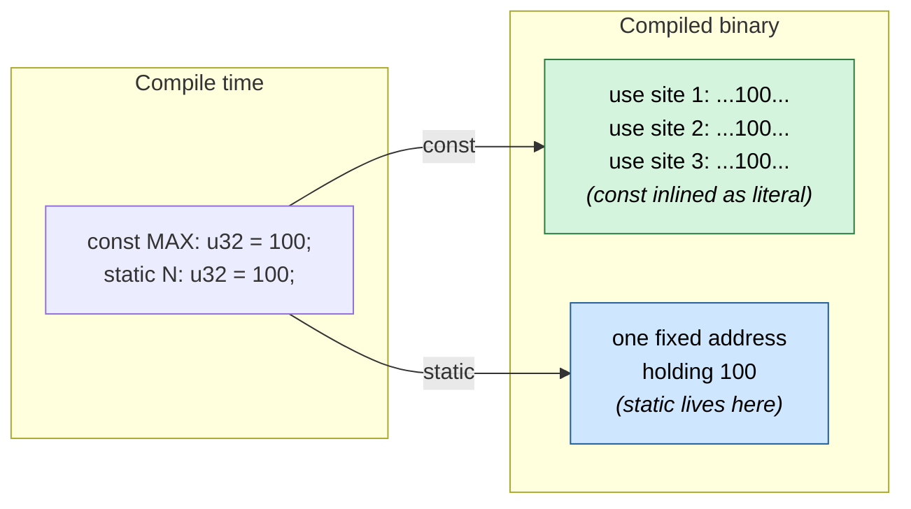

# Const vs Static — visual cheatsheet

> Companion to [[variables]]. Open this file in **Reading view** in Obsidian (Cmd-E) — Mermaid diagrams only render there, not in edit mode. Mermaid is built in; nothing to install.

Live demo crate: `code/01-fundamentals/scratch-static-counter/` — `cargo run` prints all four cases side by side.

## The mental model

```mermaid
flowchart TD
    Start([Need a named value]) --> Q1{Will it ever<br/>change at runtime?}

    Q1 -- No --> Q2{Tiny value<br/>like a number<br/>or short string?}
    Q1 -- Yes --> Q3{Single thread<br/>only?}

    Q2 -- Yes --> CONST[const NAME: T = ...<br/>inlined at every use]
    Q2 -- No, big array<br/>or need stable address --> STATIC_IMM[static NAME: T = ...<br/>one fixed address]

    Q3 -- Doesn't matter,<br/>play it safe --> MUTEX[static NAME: Mutex&lt;T&gt;<br/>= Mutex::new&#40;...&#41;<br/>safe shared mutability]
    Q3 -- Truly single thread<br/>and you accept unsafe --> SMUT[static mut NAME: T<br/>requires unsafe everywhere<br/>avoid in real code]

    style CONST fill:#d4f4dd,stroke:#2d7a3e,color:#000
    style STATIC_IMM fill:#cfe6ff,stroke:#1f5d99,color:#000
    style MUTEX fill:#cfe6ff,stroke:#1f5d99,color:#000
    style SMUT fill:#ffd7d7,stroke:#a93030,color:#000
```



Green = default. Blue = reach for it on purpose. Red = avoid.

## How they live in memory



Key takeaway: `const` has **no address** — every use is its own copy of the literal. `static` has **one address** — every use reads the same memory cell.

## Why `static + Mutex` is safe but `static mut` is not

```mermaid
sequenceDiagram
    autonumber
    participant T1 as Thread A
    participant M as Mutex&lt;u32&gt;
    participant T2 as Thread B

    Note over T1,T2: static mut UNSAFE_COUNTER (no lock)
    T1->>T1: read 5
    T2->>T2: read 5
    T1->>T1: write 6
    T2->>T2: write 6
    Note over T1,T2: ⚠️ DATA RACE — one increment lost

    Note over T1,T2: static COUNTER: Mutex&lt;u32&gt;
    T1->>M: lock() ✅
    M-->>T1: holds the key
    T2->>M: lock() ⏸ waits
    T1->>M: read 5, write 6, drop key
    M-->>T2: holds the key
    T2->>M: read 6, write 7, drop key
    Note over T1,T2: ✅ no race; counts always correct
```

The `Mutex` serializes access. Only one thread holds the lock at a time, so the read-modify-write happens atomically from the program's point of view.

## Lifetime of each kind on the timeline

```mermaid
gantt
    title Lifetime of named values during program execution
    dateFormat X
    axisFormat %s

    section Local mut
    let mut counter (in greet_local)  :a1, 0, 1

    section const
    const MAX inlined at use site     :b1, 0, 5
    const MAX inlined at another use  :b2, 2, 4

    section static
    static COUNTER lives entire program :c1, 0, 10
```



Local `mut` dies the moment the function returns. `const` is a recipe applied at each use site (no real lifetime). `static` lives from program start to program end.

## What the demo crate proves

| Demo | Approach | Outcome | Lesson |
|---|---|---|---|
| 1 | `let mut counter = 0;` inside the fn | Always prints `1` | Locals reset every call. |
| 2 | `const COUNTER: u32 = 0;` then `+= 1` | Won't compile | `const` is a value, not a variable. |
| 3 | `static mut COUNTER` + `unsafe` | Counts up: 1, 2, 3 | Works, but every access is `unsafe`. |
| 4 | `static COUNTER: Mutex<u32>` | Counts up: 1, 2, 3 | Same result, no `unsafe`, thread-safe. |

Run it yourself:
```bash
cd code/01-fundamentals/scratch-static-counter
cargo run
```

## When to actually reach for each

- **`const`** — your default. Numeric / boolean / `&str` constants, configuration knobs. ~95 % of named values.
- **`static`** (immutable) — large lookup tables, FFI requiring a stable pointer, anywhere you need a `&'static T` to share around.
- **`static` + `Mutex` / `RwLock` / `OnceLock` / `AtomicU32`** — global state that mutates: counters, caches, lazy-initialized config, connection pools.
- **`static mut`** — almost never. Only inside very low-level code where you can prove single-threaded access. The 2024 edition makes it deliberately awkward to use.

## Mermaid in Obsidian — a 30-second primer

You don't install anything. Mermaid ships with Obsidian.

```

```

Tips:
- Toggle preview with **Cmd-E**.
- Diagrams render only in Reading view, not in Live Preview / Source mode.
- Common kinds you'll use: `flowchart`, `sequenceDiagram`, `classDiagram`, `stateDiagram-v2`, `gantt`, `mindmap`.
- Cheatsheet: <https://mermaid.js.org/intro/>.
- If a label contains `()`, escape parens with `&#40;` / `&#41;`. If it contains `<` or `>`, use `&lt;` / `&gt;`.

## See also

- [[variables]] — the original prose explanation
- [[../cheatsheets/mutability-and-state|cheatsheets/mutability-and-state]] — TODO when written
- Std docs: `std::sync::Mutex`, `std::sync::OnceLock`, `std::sync::atomic`
