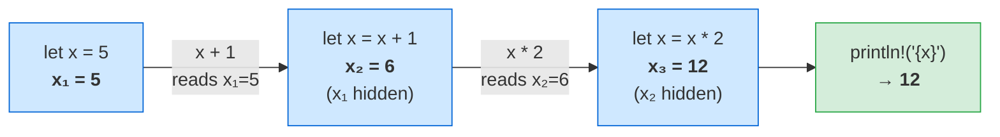
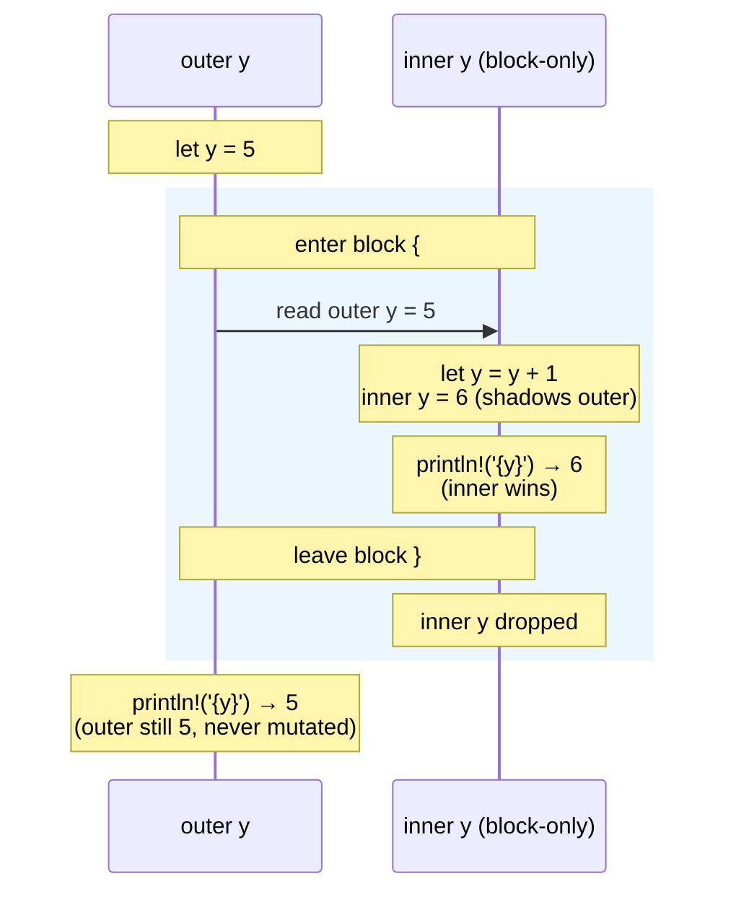
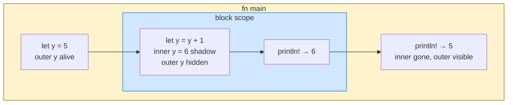
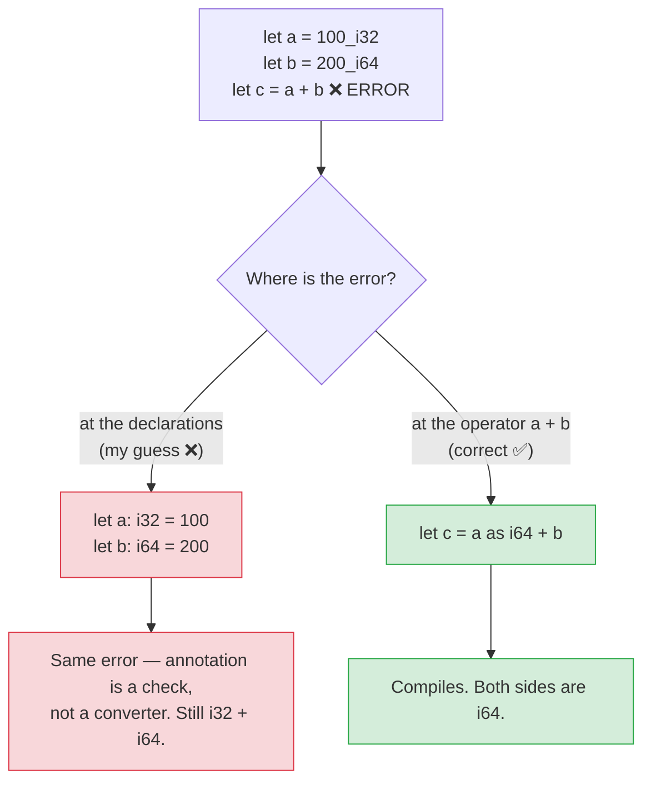
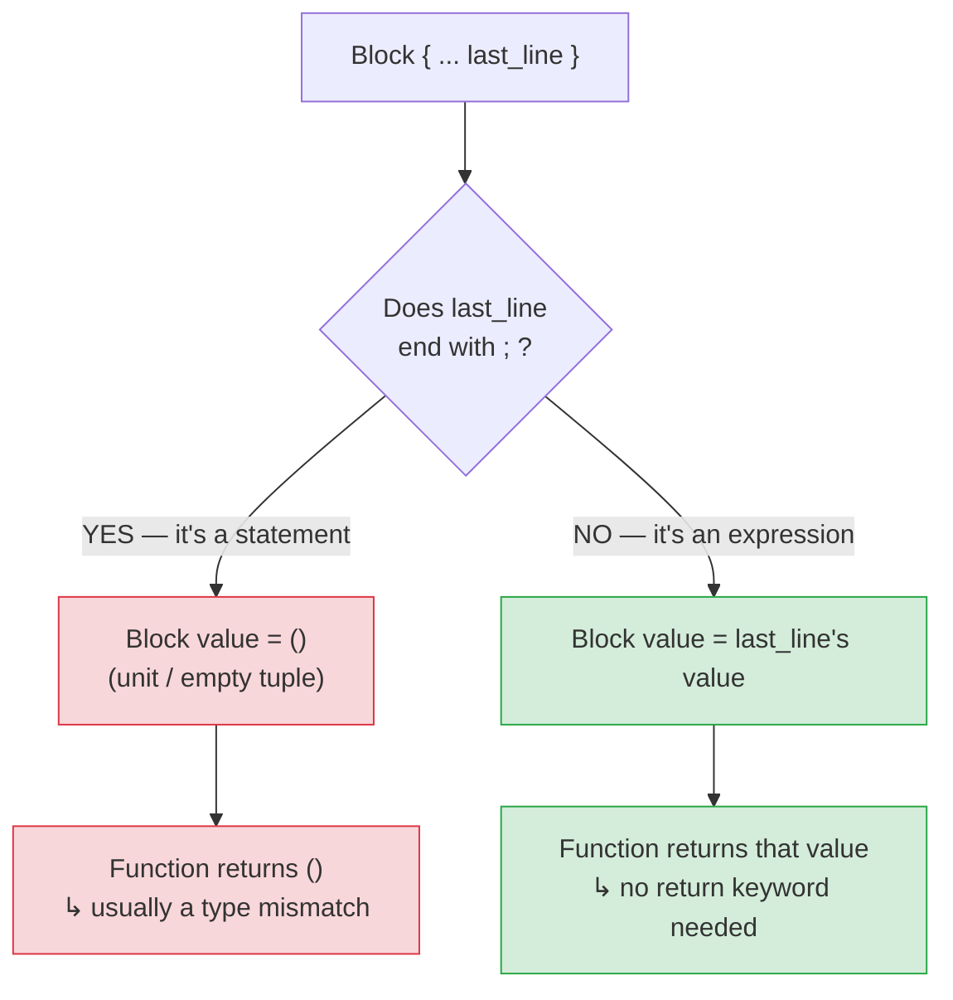
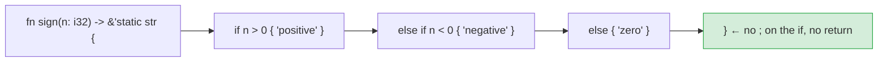
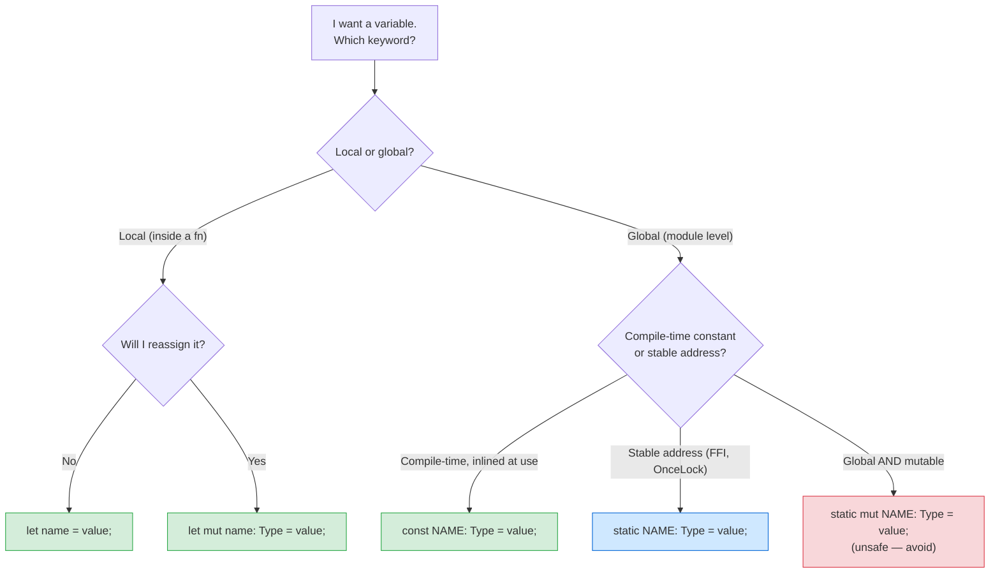
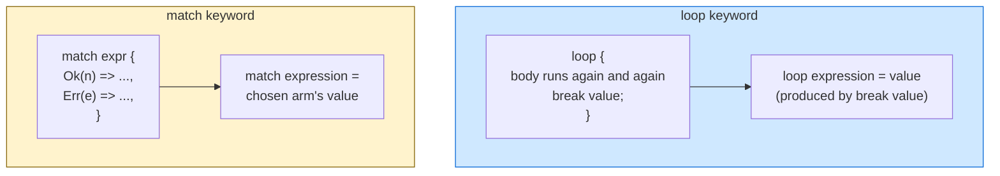
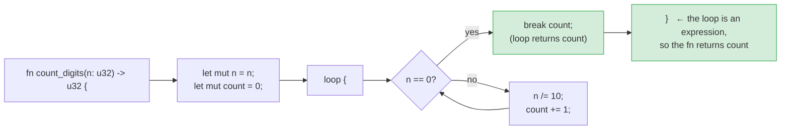

# Ch 1 — My mistakes & misunderstandings

> Personal log of what I got wrong, why I got it wrong, and the rule that fixes it.
> Reviewed at the start of every Ch 1 study session until each one feels obvious.
>
> Format per entry: `### YYYY-MM-DD — short title` → **What I wrote** / **Why it's wrong** / **The rule** / **Status** (🔴 fresh / 🟡 reviewed once / 🟢 internalized).

## Open mistakes (review these)

### 2026-05-05 — Shadowing arithmetic chain ([[exercises/ch01-fundamentals#Type system warm-up|Ex 4]] first snippet)
- **What I wrote:** guessed `10` for `let x=5; let x=x+1; let x=x*2;`.
- **Why it's wrong:** I dropped a step. Each `let x = ...` uses the **current** value of `x`, then makes a new one. So: `5 → 6 → 12`, not `10`.
- **The rule:** evaluate shadowed bindings step by step, not by collapsing the chain. The right side runs **before** the new binding is created, so the name still refers to the previous value during evaluation.

Each `let x = ...` is a **new nameplate** over the old one. The right-hand side reads the *current* `x` (the topmost plate), then a new plate is hammered on top.

- **Status:** 🟡 reviewed once (caught in the same session)

### 2026-05-18 — Locals ≠ globals; blocks ≠ functions ([[exercises/ch01-fundamentals#Type system warm-up|Ex 4]] second/third snippets)
- **What I wrote:** got the numbers right (`6` then `5`) but explained it as "y is a global variable" that "was changed inside the function".
- **Review 2026-08-10:** Correctly explained that the inner `y` shadows rather than changes the outer `y`, and that the inner binding disappears when its block ends.
- **Why it's wrong:** Three confused ideas in one sentence.
  1. `let y = 5;` in a function body is a **local** binding, not a global. In Rust, "global" means `static` or `const` at module scope (see [[const-vs-static]]).
  2. `{ ... }` is a **block**, not a function. Functions require `fn name(...) -> T { ... }`.
  3. The outer `y` was never **changed**. The inner `let y = y + 1` created a brand-new `y` visible only inside the block. When the block ends, the new `y` drops; the outer `y` (still `5`) becomes visible again.
- **The rule:**
  - Mutation (`x = 6`) needs `let mut`. Shadowing (`let x = 6`) creates a **new** binding over the top — always legal even on immutables.
  - Shadowing is scoped to the block it appears in. Leave the block → the shadow is gone, the underlying binding is visible again.
  - Mental model: each `let` is a fresh nameplate. A new plate hides the old; removing the new plate (leaving the block) reveals the old. The old value never changed.

**Block-scope shadowing on a timeline:**

The blue band is the block. Inside it, the inner `y` exists *in addition to* the outer one — it doesn't overwrite it, it just covers it. When the block ends, the cover is removed.

**Scope nesting (not function nesting):**

The yellow box (`fn main`) is the function. The blue box (`block scope`) is **just a pair of braces** — the same shape you see inside an `if { ... }`, a `for { ... }`, or a bare `{ ... }`. Blocks aren't globals, aren't functions, and don't mutate anything outside themselves. They just give a name a temporary cover.

- **Status:** 🔴 fresh — re-read the "Shadowing ≠ mutation" and "Shadowing shadows only in the current scope" sections of [[variables]].

### 2026-05-05 — Type annotation ≠ type cast ([[exercises/ch01-fundamentals#Type system warm-up|Ex 5]])
- **What I wrote:** "fix" by writing `let a: i32 = 100` and `let a: i64 = 200` (also accidentally renamed `b` to `a`).
- **Review 2026-08-10:** Correctly identified the `i32`/`i64` mismatch and that one operand must be explicitly converted to the other's type.
- **Why it's wrong:** Two errors in one.
  1. The error in the original code is at `a + b`, not at the declarations. Adding a type annotation that matches the literal suffix changes nothing — `let a: i32 = 100_i32` is identical to `let a = 100_i32`.
  2. Rust does **not** implicitly widen `i32 → i64`. `i32 + i64` is a type error, period.
- **The rule:**
  - Type annotations are *checks*, not *converters*. They never change a value's type; they assert what it already is.
  - To mix integer types, use an explicit `as` cast: `let c = (a as i64) + b;`. This is at the operator, not at the declaration.
  - Read errors at the **caret** (`^^^`) — that's where the compiler says the problem is.

Red path = my reflex (annotate the declaration). Green path = the real fix (`as` cast at the operator). The compiler's `^^^` points at `a + b`, not at `a` or `b`.

- **Status:** 🔴 fresh

### 2026-05-05 — Expressions vs statements ([[exercises/ch01-fundamentals#Expression practice|Ex 6]])
- **What I wrote:** `// i dont know` for "rewrite `sign` without `return`".
- **Review 2026-08-12:** First wrote a separate `if` whose string value was discarded by `;`, then connected the branches into one `if / else if / else` expression and correctly removed the semicolons.
- **Why it's wrong:** Not "wrong" — just unfamiliar. But it's the **single most important** Ch 1 idiom and I haven't internalized it yet.
- **The rule:**
  - `if / else if / else` is an **expression** in Rust — it produces a value.
  - A block `{ ... }` evaluates to its **last expression**, *if and only if* that expression has **no trailing `;`**. A `;` turns an expression into a statement (value `()`).
  - A function body is a block. So the function returns whatever the last expression evaluates to. No `return` keyword needed in the common case.
  - `return` is for **early** exits (e.g. guard clauses). For the final value, just leave the expression bare.

**The semicolon rule, visualized:**

**`sign` rewritten as an expression:**

The whole `if / else if / else` is one expression that evaluates to a `&str`. That value bubbles up as the block's value, which is the function's return.

- **Status:** 🟡 reviewed once — completed the exercise independently after one focused correction.

### 2026-05-05 — Keyword salad: `static const ... mut` ([[exercises/ch01-fundamentals#Expression practice|Ex 7]])
- **What I wrote:** `static const result: i32 mut = 0`.
- **Why it's wrong:** Three things are mashed together that don't combine.
  - `static` and `const` are **alternatives**, never used together.
  - `mut` goes **between** `let` and the name (`let mut x: i32 = 0`), never after the type.
  - Variable kinds are mutually exclusive: pick one of `let` / `let mut` / `const` / `static` / `static mut`.
- **The rule (memorize the shapes):**
  - `let name = value;`               — immutable local binding
  - `let mut name: Type = value;`     — mutable local binding
  - `const NAME: Type = value;`       — compile-time value, inlined, no storage
  - `static NAME: Type = value;`      — global, fixed address, immutable
  - `static mut NAME: Type = value;`  — global mutable (almost never use)

**Picking the right keyword — decision tree:**

The five shapes are mutually exclusive — pick exactly one. `static const ... mut` jams three of them together and is never valid syntax.

- **Status:** 🔴 fresh — companion note: [[const-vs-static]].

### 2026-05-05 — `loop` is not `match` ([[exercises/ch01-fundamentals#Expression practice|Ex 7]])
- **What I wrote:** `loop { Ok() => { ... }, Err() => "Failed" }`.
- **Why it's wrong:** I borrowed `Ok()`/`Err()` arm syntax from the guessing game, where it was inside a `match`. `loop` has no arms — it just runs its block forever until you `break`.
- **The rule:**
  - `loop { ... }` ≠ `match expr { ... }`. Different keyword, different shape.
  - `loop { ... break value; }` is itself an **expression** that evaluates to `value`. You can write `let x = loop { ... break 42; };` and `x` is `42`.
  - Don't reach for `Result` / `Ok` / `Err` unless the problem actually has a failure mode. `count_digits(n: u32) -> u32` has none.

**`loop` vs `match` — they don't have the same shape:**

`loop` runs its body repeatedly until `break`; `match` picks one arm once by pattern. `Ok(_) => ...` arm syntax only lives inside `match` — `loop` has no arms.

**`count_digits` with `loop` + `break value`:**

No `Result`, no `Ok`/`Err` — there's no failure mode in this signature. Just a counter and a divide-by-10 loop.

- **Status:** 🔴 fresh — re-read the loop section of [[control-flow]].

### 2026-05-24 — Referenced variable inside the loop that defines it (Ex 7 count_digits)
- **What I wrote:** `let result_count = loop { result_count += 1; ... };`
- **Why it's wrong:** `result_count` doesn't exist until the loop finishes — you can't read or write it inside the expression that creates it. The loop body runs *before* the binding is made.
- **The rule:** Declare a separate counter *before* the loop (`let mut count = 0;`), use that inside the loop, and `break count` to produce the loop's value.
- **Status:** 🔴 fresh

### 2026-05-24 — Assignment statement returns `()`, not the assigned value (Ex 7 count_digits)
- **What I wrote:** `result_count = loop { break count; }` as the last line of the function, expecting the function to return `i32`.
- **Why it's wrong:** Assignment (`x = value`) is a **statement** in Rust — it evaluates to `()`, not to `value`. A function's return value is its last *expression*; a statement there means the function returns `()`, which mismatches any non-unit return type.
- **The rule:** For the function to return a value, the last line must be a bare expression (no assignment, no `;`). Either drop the assignment and let the `loop` be the last expression, or add `result_count` on its own line after the assignment.
- **Status:** 🔴 fresh

### 2026-05-24 — `break count+1` to patch the zero edge case (Ex 7 count_digits)
- **What I wrote:** `break count+1` thinking it handles `count_digits(0)` returning 1 instead of 0.
- **Why it's wrong:** `break count+1` adds 1 to every result, not just zero — `count_digits(12345)` returns 6 instead of 5.
- **The rule:** Handle edge cases *before* the loop with an early `return`. Keep the loop body's logic uniform — `break count` is always correct once the edge case is filtered out.
- **Status:** 🔴 fresh

### 2026-08-12 — Lifetime and ownership do not mean permanent storage (`sign` follow-up)
- **What I wrote:** “THIS MEAN THOSE 3 VALUES WILL BE SAVED IN MY COMPUTER FOREVER?” and then clarified that the question was about returning `String`.
- **Why it's wrong:** A lifetime describes how long a reference is valid during program execution, while ownership describes which value must clean up runtime data. Neither promises that data remains stored on disk forever; an owned `String` is dropped when its owner leaves scope.
- **The rule:** Separate three ideas: string literals are bytes embedded in the executable, `&'static str` may reference those bytes for the program run, and `String` owns a runtime allocation that is freed on drop.
- **Status:** 🟥 fresh

### 2026-08-14 — `map` closure accidentally returned unit (FizzBuzz iterator variant)
- **What I wrote:** Used `println!` inside every `map` branch, then changed to expressions such as `"FizzBuzz".to_string();` with trailing semicolons.
- **Why it's wrong:** `map` yields whatever its closure returns. `println!` returns `()`, and a trailing semicolon discards a `String` expression and also makes the block return `()`, so the later loop tried to display unit rather than FizzBuzz text.
- **The rule:** Use `map` to return transformed values; all branches must return the same type. A block returns its final expression only when that expression has no trailing semicolon.
- **Review 2026-08-17:** Revisited the rule using the “box gives back versus throws away” analogy; it still feels difficult, so the mistake remains fresh.
- **Status:** 🟥 fresh

## Resolved (kept for reference)

> Move entries here once they feel obvious — don't delete. Future-you will skim this list as evidence of progress.

*(none yet)*

## How to use this file

- At the start of every Ch 1 session, scroll this file. The 🔴 entries get a fresh look.
- When a 🔴 entry feels obvious without re-reading the rule, change it to 🟡.
- When you'd be surprised to ever make this mistake again, change it to 🟢 and move it to **Resolved**.
- Add a new entry the moment you catch yourself making a mistake — don't wait until end-of-session, you'll forget the *why*.
