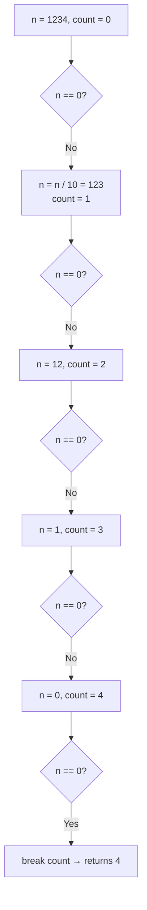

# Ch 1 — Fundamentals Exercises

## Warm-up
1. **FizzBuzz** — print 1..100, replacing multiples of 3 with `Fizz`, 5 with `Buzz`, both with `FizzBuzz`. Solve it three ways: with `if`, with `match`, and with an iterator `map`.
2. **Temperature converter** — CLI that reads an argument like `25C` or `77F` and prints the converted value.
3. **Guessing game** — the classic from the Rust book. Generate a number, prompt the user, compare, loop until right.

## Type system warm-up
4. Without running, predict what each of these prints:
   ```rust
   let x = 5;
   let x = x + 1;
   let x = x * 2;
   println!("{x}");
   // my guess: 10 because x without mut keyword is immutable
   let y = 5;
   {
       let y = y + 1;
       println!("{y}");
       // my guess: 6 because y without mut keyword us immutable so y a global variable it was changed inside the function right 
   }
   println!("{y}");
   // my guess: 5 because y is a global variable it is not changed by any function so it is just 5
   ```

5. Why does this fail to compile, and what's the minimal fix?
   ```rust
   let a = 100_i32;
   let b = 200_i64;
   let c = a + b;
   ```
   // my fix
   // let a: i32 = 100
   // let a: i64 = 200

## Expression practice
6. Rewrite the following to eliminate `return`:
   ```rust
   fn sign(n: i32) -> &'static str {
       if n > 0 { return "positive"; }
       else if n < 0 { return "negative"; }
       return "zero";
       // i dont know
   }
   ```

7. Write `fn count_digits(n: u32) -> u32` using a `loop` with `break value`.
   // my solution 
   
   static const result: i32 mut = 0 
   fn count_digits(n: u32) -> u32 {
      const result = loop {
         Ok() => {
            if(n.)
            result = 
         }
         Err() => "Failded"
      }
   }

## Checkpoint
You're done with Ch 1 when you can do all of the above without consulting docs for syntax.

---

## Answers & Explanations

> Source: [The Rust Book ch03](https://doc.rust-lang.org/book/ch03-00-common-programming-concepts.html)

### Q4 — Shadowing prediction

```rust
let x = 5;
let x = x + 1;   // x = 6  (shadows the 5)
let x = x * 2;   // x = 12 (shadows the 6)
println!("{x}"); // ✅ prints 12  ← your guess of 10 was off by one step
```

Each `let x =` is **shadowing** — it creates a brand-new binding that hides the previous one. There are **three** separate `x` values here, not a mutation of one. The second shadow (`x * 2`) operates on the already-incremented `x = 6`, so the result is `12`, not `10`.

```rust
let y = 5;
{
    let y = y + 1;   // inner y = 6
    println!("{y}"); // ✅ prints 6  ← correct
}
println!("{y}");     // ✅ prints 5  ← correct
```

The inner `let y` is scoped to the `{}` block. When the block ends, it drops and the outer `y = 5` is visible again. Your intuition here was right — the outer binding is untouched. One correction: `y` is not a "global variable"; it's a local binding in the enclosing function scope.

**Key rule:** Shadowing ≠ mutation. `let x = x + 1` makes a new slot; `mut x; x = x + 1` overwrites the existing slot. The difference matters when you need to change the **type** — mutation can't do that, shadowing can.

---

### Q5 — Type mismatch fix

```rust
let a = 100_i32;
let b = 200_i64;
let c = a + b;   // ❌ error[E0308]: mismatched types
```

**Why it fails:** Rust has **no implicit numeric coercion**. Even though `i32` fits inside `i64`, the compiler will never silently widen a type for you — that prevents subtle overflow bugs hiding in casts you didn't notice.

**Minimal fix — cast `a` to `i64` at the point of use:**

```rust
let a = 100_i32;
let b = 200_i64;
let c = a as i64 + b;  // ✅  c is i64
```

Alternatively, use `i64::from(a)` — this is safer because `from` only compiles when the conversion is *always* lossless (no truncation risk), whereas `as` is a bit cast that silently truncates on overflow:

```rust
let c = i64::from(a) + b;  // ✅ preferred — compile error if conversion is lossy
```

Your fix (`let a: i32 = 100 / let a: i64 = 200`) re-declares both variables rather than casting — that would work if you also changed one to match, but you need to actually cast at the operation site.

---

### Q6 — Eliminate `return`

In Rust, **the last expression in a block is its return value** — no `return` keyword needed (and no trailing `;`). Adding `;` changes the expression into a statement that returns `()`.

```rust
fn sign(n: i32) -> &'static str {
    if n > 0 {
        "positive"
    } else if n < 0 {
        "negative"
    } else {
        "zero"
    }
}
```

The whole `if/else if/else` is one expression. Whichever branch is taken, its string literal is the value of the expression, which is automatically returned. No `return`, no `;` on the string literals.

You can also use `match` (idiomatic for exhaustive comparison):

```rust
fn sign(n: i32) -> &'static str {
    match n.cmp(&0) {
        std::cmp::Ordering::Greater => "positive",
        std::cmp::Ordering::Less    => "negative",
        std::cmp::Ordering::Equal   => "zero",
    }
}
```

---

### Q7 — `count_digits` with `loop { break value }`

Your attempt mixed up `Ok`/`Err` (that's `Result`, used for error handling — not relevant here) and `static const` (not valid Rust syntax). The pattern you need is:

```
let result = loop {
    // do work...
    if done {
        break final_value;  // this value becomes what the loop expression evaluates to
    }
};
```

Applied to counting digits by repeatedly dividing by 10:

```rust
fn count_digits(mut n: u32) -> u32 {
    if n == 0 {
        return 1; // special case: 0 has 1 digit
    }
    let mut count = 0u32;
    loop {
        if n == 0 {
            break count; // loop evaluates to `count`, returned from the function
        }
        n /= 10;
        count += 1;
    }
}
```

**Why `mut n` in the parameter?** `mut` on a parameter just means "I want to modify my local copy of `n`" — the caller's value is unaffected (Rust passes integers by copy).

**How `break value` works (from the book):** `break` can carry an expression. The whole `loop { ... }` is an expression that evaluates to whatever you `break` with. That's why you can write `let result = loop { break 42; };` and `result` will be `42`. If the function body's last expression is the loop itself, the `break` value flows out as the return value.


